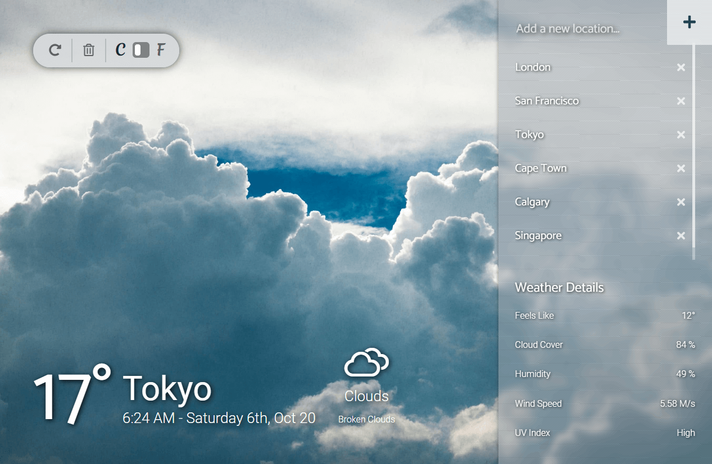

  

  <h1 align="center">🌈🌦️ my.weather</h1>

<h3 align='center'>  
    A Weather App For All Your Favourite Places On Earth.
</h3>

     
    <a href=""><strong>Visit The Site »</strong></a>
     
     
    <a href="https://github.com/Rhelli/API-Weather-App/archive/develop.zip">Download this repository</a>
    |
    <a href="https://github.com/Rhelli/API-Weather-App/issues/new/choose">Report A Bug</a>
    |
    <a href="https://github.com/Rhelli/API-Weather-App/fork">Fork It</a>
  

## 🔖 Table of Contents
  - [The Project Brief](https://github.com/Rhelli/Restaurant-Website/tree/feature/readme#-the-project-brief)
  - [The Nitty Gritty](https://github.com/Rhelli/Restaurant-Website/tree/feature/readme#-the-nitty-gritty)
  - [Tools & Technology Used](https://github.com/Rhelli/Restaurant-Website/tree/feature/readme#-tools--technology-used)
  - [Setup & Use](https://github.com/Rhelli/Restaurant-Website/tree/feature/readme#%EF%B8%8F-setup--use)
  - [Showcase](https://github.com/Rhelli/Restaurant-Website/tree/feature/readme#-showcase)
  - [Contributions, Issues and Forking](https://github.com/Rhelli/Restaurant-Website/tree/feature/readme#-contributions-issues-and-forking)
  - [Creator](https://github.com/Rhelli/Restaurant-Website/tree/feature/readme#%EF%B8%8F-creator)
  - [Show Your Support!](https://github.com/Rhelli/Restaurant-Website/tree/feature/readme#%EF%B8%8F-show-your-support)
  - [Licensing](https://github.com/Rhelli/Restaurant-Website/tree/feature/readme#-licensing)

## 🔰 The Project Brief

This is a project to be included by all students at [Microverse](https://www.microverse.org/) as part of the Javascript module.

In this project, we are tasked with creating a weather forecasting app using a weather API of our choice. The creative license was open ended and thus we were given the choice of making an app that spanned anywhere from simple, single-location forecasting, all the way through to multi-location, multi-date forecasting. The imperitive lesson, however, was to get to grips with interacting with API data, formatting and parsing that data, and displaying it in a pleasant and readable way for the end-user.

## 🔬 The Nitty Gritty
Following lessons on Promises, Async/Await and the Fetch API, the core objective for this project was to grab a given API's data by creating successful API calls byy utilising Async and Await functionality. Following successful API calls and having obtained the requested data, the following steps were to format that data into a readable format for the end-user. Additional functionality includes the following:

 - Utilisation of local storage to allow user to store and easily access their favourite locations.
 - Automatic background image matching to the forecasted weather (with day and night cycles integrated).
 - Celsius & Fahrenheit preference selection (with memory of your selection).
 - A 'Delete-my-data' button, for those of us who prefer to keep our data, ours.
 - Fully responsive from Large screen sizes down to mobile.

In total, two separate API services were used, the [OpenWeather API](https://openweathermap.org/api) for all the weather forecasting data, and the [TimeZoneDB API](https://timezonedb.com/) for generating an accurate time and date per location.

The totality of the above, was built using solely Webpack, Javascript and SCSS.

## 👀 Tools & Technology Used
**Languages & Frameworks**
 - Javascript
 - Webpack 4.44
 - SASS

**Package Management & Packages**
 - NPM
 - [Date-fns](https://date-fns.org/) for datetime formatting

**APIs Used**
 - [OpenWeather API](https://openweathermap.org/api)
 - [TimeZoneDB API](https://timezonedb.com/)

**Linters & Quality Control**
 - [ESlint](https://eslint.org/)
 - [StyleLint](https://stylelint.io/)

### 🛠️ Setup & Use

#### Setup
For the live site, [head here.]()

1. To inspect and tinker with the code on your system, download this repo either [here]() or from the link at the top of the page

2. Now it's time to ensure you've got Node and NPM installed. If you do, skip this step. Otherwise, head on over to [nodejs's website](https://nodejs.org/en/) to download node with npm.

3. Time to go back to the project! Open your terminal (either in your text editor or otherwise) and 'cd' (i.e. navigate) to the root of this repo.

4. Time to install Webpack! Ensuring you're at this repo's root, enter the following command into your terminal. This will install webpack locally (to this project only):
    
        npm install --save-dev webpack

5. Finally, once webpack has installed successfully, run the following command to install all of the projects dependencies:

        npm install

#### Usage
There are a few commands that you can use interact with the project:
 - `$npm run build` - This will build the project using webpack and bundle everything into the `/dist` folder.
 - `$npm run watch` - This will build and update the project in the `/dist` folder **actively**, meaning changes will update `/dist`. You will, however, have to refresh the browser to see changes.
 - `$npm run start` - This will build and update the project with changes. No browser refresh required.

******

## 🔮 Showcase

### Adding New Locations

> New locations can be added, stored and removed in the sidebar. The last selected location is always remembered and loaded first.

### Adding and Changing Between Saved Locations

> As the user adds and saves new locations, their weather data can be easily accessed.

### Adding New Locations On Mobile

> A similar view of adding new locations on mobile sized screens.

*******

## ✋🏽 Contributions, Issues and Forking

Contributions, issues and feature requests are more than welcome! 

If you have any problems running or setting up this project, please submit it as a bug on the [issues page](https://github.com/Rhelli/API-Weather-App/issues) right away!

If you want to make your own changes, modifications or improvements, go ahead and Fork it!
1. [Fork it](https://github.com/Rhelli/API-Weather-App/fork)
2. Create your working branch (git checkout -b [choose-a-name])
3. Commit your changes (git commit -am 'what this commit will fix/add/improve')
4. Push to the branch (git push origin [chosen-name])
5. Create a new Pull Request

## 🤪 Creator

💂🏽‍♂️ Rory Hellier - [Github](https://github.com/Rhelli)

## 🙋🏽‍♂️ Show Your Support!
Give a ⭐️ if you like this project!

## 📑 Licensing
This project is [MIT](https://github.com/Rhelli/API-Weather-App/LICENSE.txt) licensed.